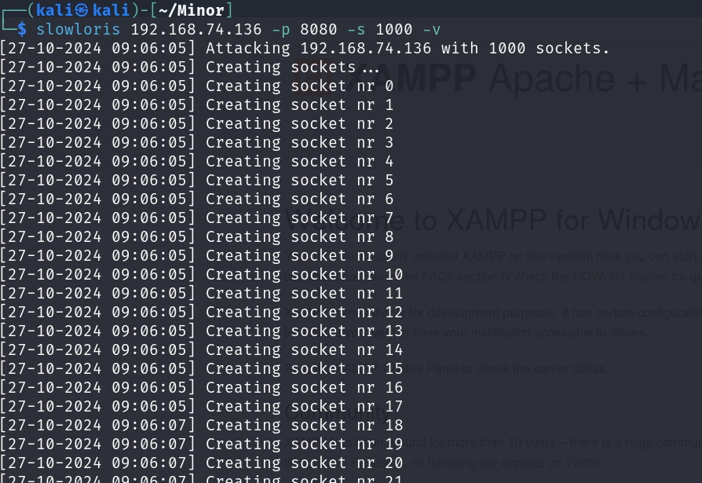

# Project Overview

This project focuses on detecting and mitigating Denial of Service (DoS) and Distributed Denial of Service (DDoS) attacks using a Python-based system. The solution employs real-time network traffic monitoring, threshold-based detection, and automated IP blocking to ensure network availability and resilience against cyber threats.

## Features

- Real-time traffic analysis and anomaly detection.
- Dynamic IP blocking and unblocking with cooldown periods.
- Automated logging and reporting for forensic analysis.
- High scalability and adaptability for different network configurations.

## Installation

1. Clone the repository:
    ```bash
    git clone https://github.com/unablefinduser/Dos-DDos-detection-and-mitigation
    cd dos-ddos-detection
    ```

2. Install dependencies:
    ```bash
    pip install -r requirements.txt
    ```

3. Run the main script:
    ```bash
    python src/ddos_detector.py --cooldown 60
    ```

## Usage

- Modify thresholds and cooldown parameters in `ddos_detector.py` as needed.
- Use `examples/run_example.sh` to see a demonstration.
- Refer to `docs/report.pdf` for detailed documentation.

---

## Lab Simulation Setup

This project simulates a real-world DoS/DDoS attack using two machines:

- **Linux** as the attacker (Slowloris tool)
- **Windows** as the target (Local HTTP server + Detection script)

### 🖥️ Windows (Target Machine)

1. **Start a Local Web Server**:
    ```bash
    python -m http.server 8080
    ```

2. **Update Detection Script Port**:
    Open `ddos_detector.py` and ensure:
    ```python
    TARGET_PORT = 8080
    ```

3. **Run the Detection Script**:
    ```bash
    python src/ddos_detector.py
    ```

### 🐧 Linux (Attacking Machine)

1. **Install Slowloris**:
    ```bash
    git clone https://github.com/gkbrk/slowloris.git
    cd slowloris
    ```

2. **Launch the Attack**:
    ```bash
    slowloris <target ip> -p <port> -s <number> -v
    ```

> ⚠️ Replace `<windows-ip>` with the actual IP address of the Windows machine.

###  Demo Screenshots


**1. Slowloris Attack from Linux:**



**3. Python Detection Output:**


---

## Contribution

Feel free to open issues or contribute by submitting pull requests. Ensure all code changes are tested.
